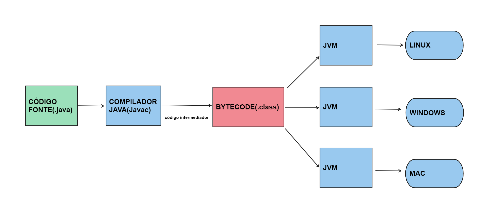

# Java: Introdução

Java é uma linguagem de programação orientada a objetos amplamente utilizada para o desenvolvimento de aplicações, desde sistemas desktop até aplicações web e móveis. Criada pela Sun Microsystems em 1995 e atualmente mantida pela Oracle, Java é conhecida por sua portabilidade e robustez.

## Sumário

1. [Introdução](#introdução)
2. [Como o Java funciona?](#como-o-java-funciona)
3. [Tipos Primitivos](#tipos-primitivos)
4. [Operadores em Java](#operadores-em-java)
5. [Estruturas Condicionais](#estruturas-condicionais)
6. [Laços de Repetição](#laços-de-repetição)
7. [Arrays](#arrays)
8. [Conclusão](#conclusao)


## Como o Java funciona?

O funcionamento do Java baseia-se no conceito de "Write Once, Run Anywhere" (Escreva uma vez, execute em qualquer lugar). Isso é possível graças à sua arquitetura baseada em máquina virtual:

1. **Código-fonte:** Você escreve o código em arquivos com extensão `.java`.
2. **Compilação:** O compilador Java (`javac`) converte o código-fonte em bytecode, que é armazenado em arquivos `.class`. O bytecode é um código intermediário independente de plataforma.
3. **Execução:** A Java Virtual Machine (JVM) interpreta ou compila o bytecode para o código nativo da máquina em que está sendo executado.

A JVM é a chave para a portabilidade do Java, pois cada sistema operacional tem sua própria implementação da JVM. Isso permite que o mesmo bytecode funcione em diferentes plataformas sem modificações.


*Figura 1: Processo de compilação em Java*

## Tipos Primitivos em Java

Java possui oito tipos primitivos, que são usados para armazenar valores simples. Esses tipos são:

```java
byte b = 100;      // Inteiro de 8 bits
short s = 1000;    // Inteiro de 16 bits
int i = 100000;    // Inteiro de 32 bits
long l = 100000L;  // Inteiro de 64 bits
float f = 10.5f;   // Ponto flutuante de 32 bits
double d = 10.5;   // Ponto flutuante de 64 bits
char c = 'A';      // Caractere Unicode de 16 bits
boolean flag = true; // Booleano (true ou false)
```

## Operadores Aritméticos em Java

Os operadores aritméticos são usados para realizar operações matemáticas básicas.

```java
int soma = 10 + 5; //Soma dois valores.
int diferenca = 10 - 5;//Subtrai o segundo valor do primeiro.
int produto = 10 * 5;//Multiplica dois valores.
int quociente = 10 / 5;//Divide o primeiro valor pelo segundo.
int resto = 10 % 3;//Retorna o resto da divisão do primeiro valor pelo segundo.
int i = 5;
i++; // i = 6 Incrementa o valor de uma variável em 1.
i--; // i = 4 Decrementa o valor de uma variável em 1.
```

## Operadores Lógicos em Java

Os operadores lógicos são usados para realizar operações lógicas entre expressões booleanas. 

```java
1. //&& (E): Retorna `true` se ambas as expressões forem verdadeiras.
         boolean result = (5 > 3) && (10 < 20); // result será true`

2. //|| (OU) : Retorna `true` se pelo menos uma das expressões for verdadeira.
         boolean result = (5 > 3) || (10 > 20); // result será true`

3. //! (NÃO): Inverte o valor da expressão booleana.
        boolean result = !(5 > 3); // result será false`

4. //^ (EXCLUSIVO): Retorna `true` se as expressões forem diferentes (uma verdadeira e outra falsa).
        boolean result = (5 > 3) ^ (10 > 20); // result será true`
```

# Estruturas Condicionais em Java

Em Java, as estruturas condicionais são utilizadas para controlar o fluxo de execução do programa com base em condições. Essas estruturas permitem que o programa tome decisões e execute diferentes blocos de código conforme necessário.

## `if`, `else if` e `else`
A estrutura `if-else` é usada para executar blocos de código dependendo da veracidade de uma condição.

### Exemplo de `if`
```java
int numero = 10;
if (numero > 0) {
    System.out.println("O número é positivo.");
}
```
Se `numero` for maior que 0, a mensagem "O número é positivo." será exibida.

### Exemplo de `if-else`
```java
int numero = -5;
if (numero > 0) {
    System.out.println("O número é positivo.");
} else {
    System.out.println("O número é negativo ou zero.");
}
```
Se `numero` for maior que 0, exibe "O número é positivo.". Caso contrário, exibe "O número é negativo ou zero.".

### Exemplo de `if-else if-else`
```java
int numero = 0;
if (numero > 0) {
    System.out.println("O número é positivo.");
} else if (numero < 0) {
    System.out.println("O número é negativo.");
} else {
    System.out.println("O número é zero.");
}
```
Aqui, o código verifica se `numero` é positivo, negativo ou zero e exibe a mensagem correspondente.

## `switch-case`
A estrutura `switch-case` é usada quando há múltiplas condições a serem avaliadas para uma mesma variável.

### Exemplo de `switch-case`
```java
int dia = 3;
switch (dia) {
    case 1:
        System.out.println("Domingo");
        break;
    case 2:
        System.out.println("Segunda-feira");
        break;
    case 3:
        System.out.println("Terça-feira");
        break;
    case 4:
        System.out.println("Quarta-feira");
    default:
        System.out.println("Dia inválido");
}
```
Neste exemplo, a variável `dia` é avaliada, e a mensagem correspondente ao número é exibida. O `default` é usado caso nenhum dos valores especificados seja atendido.

## Operador Ternário
O operador ternário `? :` é uma forma compacta de escrever uma condição `if-else`.

### Exemplo de operador ternário
```java
int numero = 10;
String resultado = (numero > 0) ? "Positivo" : "Negativo ou zero";
System.out.println(resultado);
```
Se `numero` for maior que 0, `resultado` receberá "Positivo"; caso contrário, receberá "Negativo ou zero".

# Laços de Repetição em Java

Os laços de repetição em Java permitem a execução de um bloco de código múltiplas vezes enquanto uma determinada condição for verdadeira. Eles são essenciais para automatizar tarefas repetitivas e reduzir a necessidade de código redundante.

## `for`
O laço `for` é utilizado quando o número de iterações é conhecido previamente.

### Exemplo de `for`
```java
for (int i = 1; i <= 5; i++) {
    System.out.println("Iteração: " + i);
}
```
Neste exemplo, a variável `i` é inicializada com `1`, e o laço continua até que `i` seja maior que `5`, incrementando `i` a cada iteração.

## `while`
O laço `while` é usado quando a condição de repetição depende de uma verificação contínua.

### Exemplo de `while`
```java
int i = 1;
while (i <= 5) {
    System.out.println("Iteração: " + i);
    i++;
}
```
Aqui, enquanto `i` for menor ou igual a `5`, o bloco de código será executado, incrementando `i` a cada ciclo.

## `do-while`
O laço `do-while` garante que o bloco de código seja executado pelo menos uma vez antes da verificação da condição.

### Exemplo de `do-while`
```java
int i = 1;
do {
    System.out.println("Iteração: " + i);
    i++;
} while (i <= 5);
```
Neste caso, a primeira iteração ocorre independentemente da condição, que só é verificada após a execução do bloco de código.

## `foreach` (Enhanced for loop)
O `foreach`, ou laço aprimorado `for`, é usado para percorrer elementos de arrays e coleções sem a necessidade de um índice explícito.

### Exemplo de `foreach`
```java
int[] numeros = {1, 2, 3, 4, 5};
for (int num : numeros) {
    System.out.println("Número: " + num);
}
```
Aqui, cada elemento do array `numeros` é armazenado na variável `num` e impresso no console.
# Arrays em Java

Os arrays em Java são estruturas de dados que armazenam múltiplos valores do mesmo tipo em uma única variável. Eles são úteis para lidar com conjuntos de elementos de forma eficiente.

## Declaração e Inicialização de Arrays

### Declaração de um Array
```java
int[] numeros; // Declara um array de inteiros
```

### Inicialização de um Array
```java
numeros = new int[5]; // Define um array com 5 posições
```
Ou declarando e inicializando ao mesmo tempo:
```java
int[] numeros = {1, 2, 3, 4, 5};
```

## Acessando Elementos do Array
Cada elemento do array pode ser acessado usando seu índice, que começa em `0`.
```java
int primeiro = numeros[0]; // Acessa o primeiro elemento
System.out.println("Primeiro número: " + primeiro);
```

## Percorrendo um Array

### Usando `for`
```java
for (int i = 0; i < numeros.length; i++) {
    System.out.println("Elemento na posição " + i + ": " + numeros[i]);
}
```

### Usando `foreach`
```java
for (int num : numeros) {
    System.out.println("Número: " + num);
}
```

## Arrays Multidimensionais
Arrays podem ter múltiplas dimensões, como matrizes.

### Declaração e Inicialização de um Array Bidimensional
```java
int[][] matriz = {
    {1, 2, 3},
    {4, 5, 6},
    {7, 8, 9}
};
```

### Acessando Elementos da Matriz
```java
int elemento = matriz[1][2]; // Acessa o elemento na segunda linha e terceira coluna
System.out.println("Elemento: " + elemento);
```

### Percorrendo uma Matriz
```java
for (int i = 0; i < matriz.length; i++) {
    for (int j = 0; j < matriz[i].length; j++) {
        System.out.print(matriz[i][j] + " ");
    }
    System.out.println();
}
```


