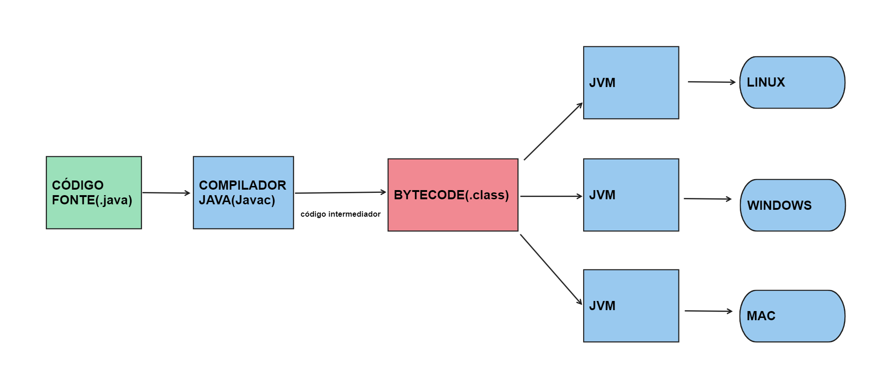

# Java: Introdução

Java é uma linguagem de programação orientada a objetos amplamente utilizada para o desenvolvimento de aplicações, desde sistemas desktop até aplicações web e móveis. Criada pela Sun Microsystems em 1995 e atualmente mantida pela Oracle, Java é conhecida por sua portabilidade e robustez.

## Como o Java funciona?

O funcionamento do Java baseia-se no conceito de "Write Once, Run Anywhere" (Escreva uma vez, execute em qualquer lugar). Isso é possível graças à sua arquitetura baseada em máquina virtual:

1. **Código-fonte:** Você escreve o código em arquivos com extensão `.java`.
2. **Compilação:** O compilador Java (`javac`) converte o código-fonte em bytecode, que é armazenado em arquivos `.class`. O bytecode é um código intermediário independente de plataforma.
3. **Execução:** A Java Virtual Machine (JVM) interpreta ou compila o bytecode para o código nativo da máquina em que está sendo executado.

A JVM é a chave para a portabilidade do Java, pois cada sistema operacional tem sua própria implementação da JVM. Isso permite que o mesmo bytecode funcione em diferentes plataformas sem modificações.

